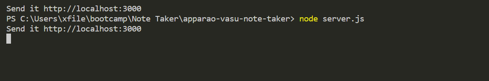
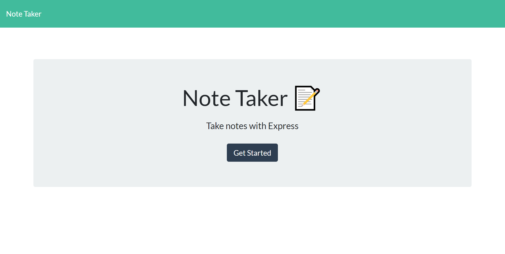
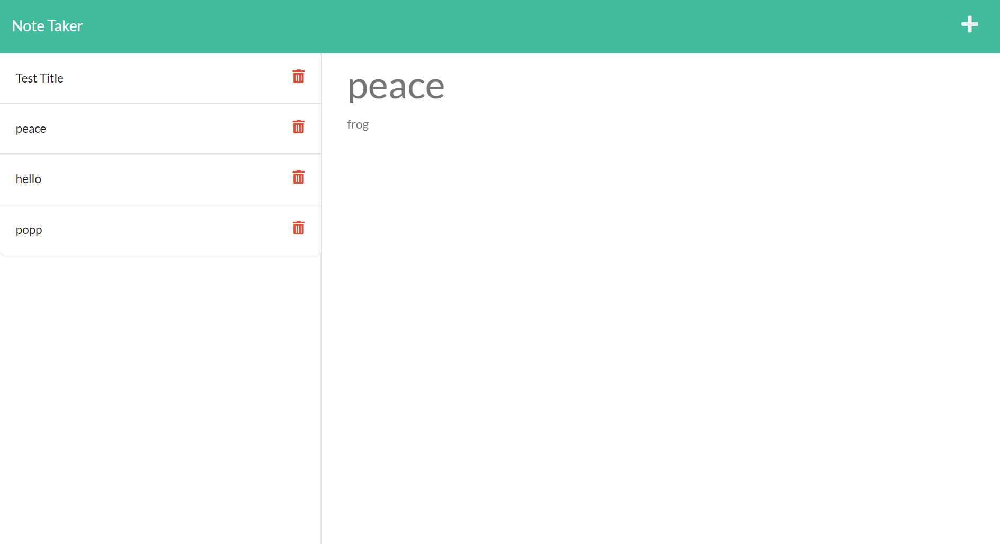

# Note Taker

## Deployable Link


## Goal
The task was to make a note taker website that could save inputs, as well as clickable past notes to search, as well as use server.js to run things back end.

## Technology Use
  - Javascript
  - HTML
  - CSS
  - JQuery
  - Node.js
  - Express
  - uuid
  - Require
  - VS Code
  - Git Bash 
  - GitHub

## Execution
The first part of making the note taker to work was to create a server.js and npm install uuid and express. Since most of the code was given, server.js was the main file to make the note taker website to operate. The first thing written on the server.js file was writing the const variable as well as variables to link pathways on index.js and other files to server.js shown below:

```Javascript
const express = require('express');
const path = require('path');
const fs = require("fs")
var everyNote = require('./db/db.json');
const uuid = require('uuid')
const { text } = require('express');
const PORT = process.env.port || 3000;

const app = express();

```
The following lines of code are built in features that are key to make the server.js work as intended. Without it, the website would not work.

```Javascript
app.use(express.urlencoded({ extended: true }));
app.use(express.static('public'));
app.use(express.json());

  module.exports = Employee;
```
In order to generate the inputs from the website and save the inputs so that the user can click on a past note that was saved and view it, a combination of app.get and app.post crud methods in order to make the main function of the the website to work. The following code demonstrates this.
```Javascript
app.post('/api/notes', (req, res) => {
  const {title, text} = req.body

  if (title && text){
    const genTitle = {
      title,
      text,
      id: uuid.v1()
    }
    fs.readFile('./db/db.json', 'utf8', (err, data) => {
      if (err) {
        console.error(err);
      } else {
        
        const parsedNotes = JSON.parse(data);

        
        parsedNotes.push(genTitle);
        everyNote = parsedNotes;
      
        
        fs.writeFile(
          './db/db.json',
          JSON.stringify(parsedNotes, null, 3),
          (writeErr) =>
            writeErr
              ? console.error(writeErr)
              : console.info('Dutifully Noted Sir!')
        );
      }
      
      res.json(everyNote)

  })
}
});
```
The final line of code generates the localhost link within the terminal. That code looks like the one below.
```Javascript
app.listen(PORT, () => {
  console.log(`Send it http://localhost:${PORT}`);
});
```

## Result

The following website demonstrates what the final product looks like:

Running the server using the terminal and producing the link:



Website itself:


Note Taker with past notes

